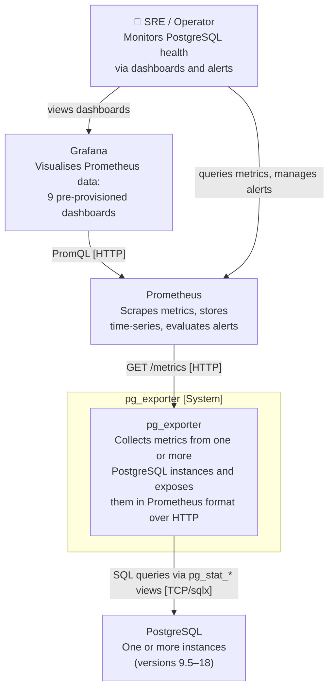
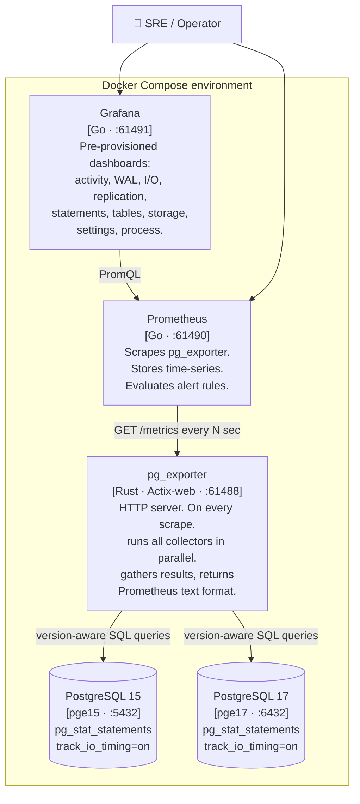
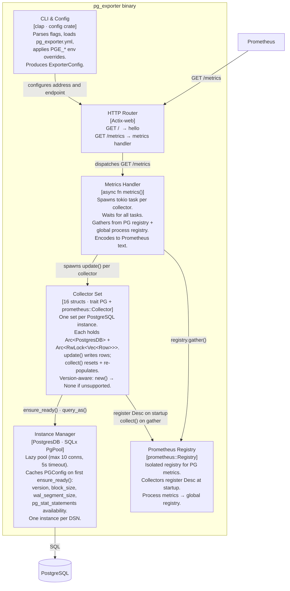
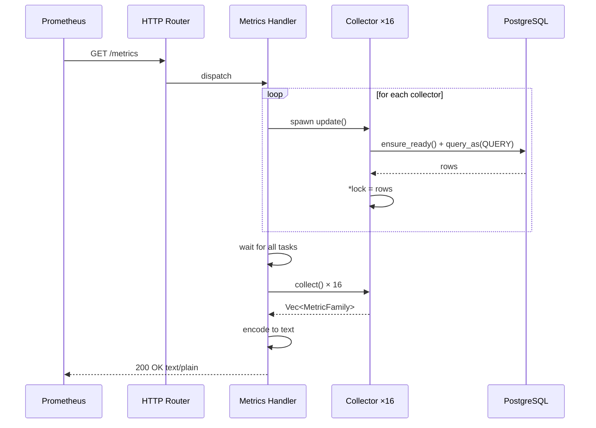
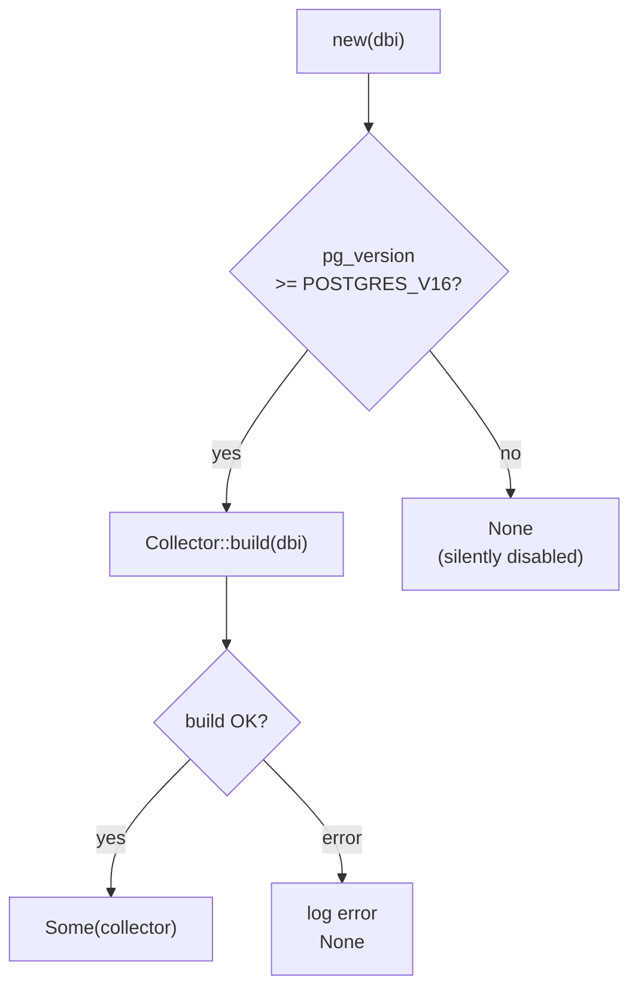

# pg_exporter — Architecture (C4 Model)

## Level 1 — System Context

Who uses the system and what it talks to.



---

## Level 2 — Containers

Processes and datastores that make up the running system.



---

## Level 3 — Components

Components inside the `pg_exporter` binary.



---

## Level 4 — Code

The collector pattern that all 16 collectors follow.

### Structs and trait relationships

```
┌─────────────────────────────────────────────────────────────┐
│  PGFooCollector                                             │
│                                                             │
│  dbi:  Arc<PostgresDB>       ← shared connection pool      │
│  data: Arc<RwLock<Vec<Row>>> ← snapshot of last query      │
│  descs: Vec<Desc>            ← metric descriptors          │
│  my_gauge: GaugeVec          ← Prometheus metric           │
├─────────────────────────────────────────────────────────────┤
│  impl PG                                                    │
│    async fn update()                                        │
│      1. dbi.ensure_ready().await?      ← connect / cache   │
│      2. sqlx::query_as(QUERY)          ← version-aware SQL │
│      3. *data.write() = rows           ← overwrite state   │
├─────────────────────────────────────────────────────────────┤
│  impl prometheus::Collector                                 │
│    fn collect() → Vec<MetricFamily>                         │
│      1. data.read()                    ← snapshot          │
│      2. gauge.reset()                  ← purge stale labels│
│      3. gauge.with_label_values().set()                     │
│      4. gauge.collect()               ← emit families      │
└─────────────────────────────────────────────────────────────┘

update() and collect() are intentionally separate:
  update() — async, hits PostgreSQL, writes data
  collect() — sync, reads data, builds metric families
```

### Sequence — one scrape cycle



### Version gate in `new()`



---

## Key design decisions

| Decision | Rationale |
|---|---|
| `update()` async, `collect()` sync | Prometheus calls `collect()` synchronously from its gather loop; async DB queries must not block it |
| `Arc<RwLock<Vec<Row>>>` between update and collect | Zero-copy share of the row snapshot; multiple concurrent readers unblocked during a write |
| Lazy pool connection (`connect_lazy`) | Exporter starts and serves even when PostgreSQL is temporarily unreachable; errors surface in `update()`, not at startup |
| `PGConfig` cached after first `ensure_ready()` | PG version, block size, and extension availability are stable; no need to re-query on every scrape |
| `GaugeVec::reset()` before re-populating | Prevents stale label combinations from accumulating when a setting value or query text changes between scrapes |
| `new()` returns `Option` | Each collector self-selects based on PG version; no central version dispatch needed |
| One `Registry` per exporter, separate from global | Avoids metric name collisions when multiple PostgreSQL instances are configured |
| `const_labels` per instance | Differentiates metrics from multiple PG instances (e.g. `cluster="prod"`) without separate exporters |
