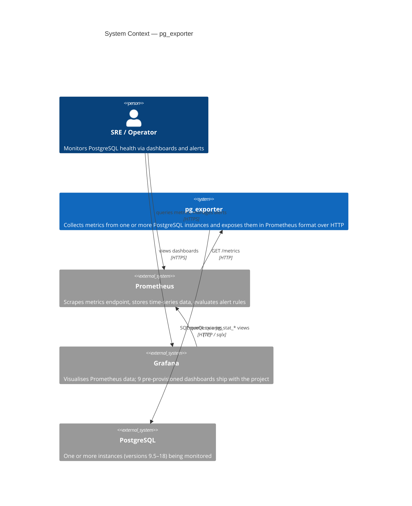

# pg_exporter — Architecture (C4 Model)

## Level 1 — System Context

Who uses the system and what it talks to.



---

## Level 2 — Containers

Processes and datastores that make up the running system.

```mermaid
C4Container
    title Containers — pg_exporter deployment

    Person(sre, "SRE / Operator")

    Container(exporter, "pg_exporter", "Rust · Actix-web",
        "HTTP server. On every scrape, runs all collectors in parallel, gathers results from the Prometheus registry, and returns Prometheus text format.")

    Container(prometheus, "Prometheus", "Go",
        "Scrapes pg_exporter on a configurable interval. Stores time-series. Evaluates alerting rules.")

    Container(grafana, "Grafana", "Go",
        "Pre-provisioned dashboards for activity, WAL, I/O, replication, statements, tables, storage, settings, process.")

    ContainerDb(pg1, "PostgreSQL (instance 1)", "PostgreSQL 9.5–18",
        "Primary monitoring target. Exposes pg_stat_* views, pg_show_all_settings(), and optional pg_stat_statements.")

    ContainerDb(pgN, "PostgreSQL (instance N)", "PostgreSQL 9.5–18",
        "Additional instances. Each gets its own connection pool and collector set inside pg_exporter.")

    Rel(prometheus, exporter, "GET /metrics every N seconds", "HTTP :61488")
    Rel(exporter, pg1, "version-aware SQL queries", "TCP :5432")
    Rel(exporter, pgN, "version-aware SQL queries", "TCP :XXXX")
    Rel(grafana, prometheus, "PromQL", "HTTP :61490")
    Rel(sre, grafana, "", "HTTP :61491")
    Rel(sre, prometheus, "", "HTTP :61490")
```

---

## Level 3 — Components

Components inside the `pg_exporter` binary.

```mermaid
C4Component
    title Components — pg_exporter binary

    Container_Boundary(exporter, "pg_exporter") {

        Component(cli, "CLI & Config",
            "clap · config crate",
            "Parses CLI flags (-c, run, configcheck). Loads pg_exporter.yml. Applies PGE_* environment overrides. Produces ExporterConfig.")

        Component(router, "HTTP Router",
            "Actix-web",
            "GET /  → hello handler\nGET /metrics → metrics handler\nServes on configured listen_addr.")

        Component(handler, "Metrics Handler",
            "async fn metrics()",
            "Spawns one tokio task per collector (update). Waits for all tasks. Gathers from both PG registry and global process registry. Encodes to Prometheus text format.")

        Component(collectors, "Collector Set",
            "16 structs · trait PG + prometheus::Collector",
            "One set per PostgreSQL instance. Each collector owns Arc<PostgresDB> and Arc<RwLock<Vec<Row>>>. update() writes rows; collect() resets GaugeVec and re-populates from rows. Version-aware: new() returns None if PG version is unsupported.")

        Component(instance, "Instance Manager",
            "PostgresDB · SQLx PgPool",
            "Lazy connection pool (max 10 conns, 5 s timeout). Caches PGConfig (pg_version, block_size, wal_segment_size, pg_stat_statements availability) on first successful connect via ensure_ready(). One instance per configured PostgreSQL DSN.")

        Component(registry, "Prometheus Registry",
            "prometheus::Registry",
            "Isolated registry for all PG metrics. Collectors register their descriptors at startup. Process metrics go to the default global registry.")
    }

    System_Ext(postgres, "PostgreSQL")
    System_Ext(prometheus, "Prometheus")

    Rel(cli, router, "configures bind address and endpoint path")
    Rel(router, handler, "dispatches GET /metrics")
    Rel(handler, collectors, "spawns update() per collector")
    Rel(collectors, instance, "ensure_ready() · sqlx::query_as()")
    Rel(instance, postgres, "SQL", "TCP")
    Rel(collectors, registry, "registers Desc on startup · collect() on gather")
    Rel(handler, registry, "registry.gather()")
    Rel(prometheus, router, "GET /metrics")
```

---

## Level 4 — Code

The collector pattern that all 16 collectors follow.

### Structs and trait relationships

```
┌─────────────────────────────────────────────────────────────┐
│  PGFooCollector                                             │
│                                                             │
│  dbi:  Arc<PostgresDB>       ← shared connection pool      │
│  data: Arc<RwLock<Vec<Row>>> ← snapshot of last query      │
│  descs: Vec<Desc>            ← metric descriptors          │
│  my_gauge: GaugeVec          ← Prometheus metric           │
├─────────────────────────────────────────────────────────────┤
│  impl PG                                                    │
│    async fn update()                                        │
│      1. dbi.ensure_ready().await?      ← connect / cache   │
│      2. sqlx::query_as(QUERY)          ← version-aware SQL │
│      3. *data.write() = rows           ← overwrite state   │
├─────────────────────────────────────────────────────────────┤
│  impl prometheus::Collector                                 │
│    fn collect() → Vec<MetricFamily>                         │
│      1. data.read()                    ← lock-free read    │
│      2. gauge.reset()                  ← purge stale labels│
│      3. gauge.with_label_values().set()                     │
│      4. gauge.collect()                ← emit families     │
└─────────────────────────────────────────────────────────────┘
```

### Sequence — one scrape cycle

```
Prometheus          Actix-web           Collector (×16)      PostgreSQL
    │                   │                     │                   │
    │  GET /metrics      │                     │                   │
    │──────────────────▶│                     │                   │
    │                   │  spawn update()      │                   │
    │                   │────────────────────▶│                   │
    │                   │                     │  ensure_ready()    │
    │                   │                     │  query_as(QUERY)  │
    │                   │                     │──────────────────▶│
    │                   │                     │  rows             │
    │                   │                     │◀──────────────────│
    │                   │                     │  *lock = rows      │
    │                   │  (all tasks done)    │                   │
    │                   │◀────────────────────│                   │
    │                   │  registry.gather()   │                   │
    │                   │  → collect() ×16     │                   │
    │                   │────────────────────▶│                   │
    │                   │  Vec<MetricFamily>   │                   │
    │                   │◀────────────────────│                   │
    │  200 OK text/plain│                     │                   │
    │◀──────────────────│                     │                   │
```

### Version gate in new()

```
pub fn new(dbi: Arc<PostgresDB>) -> Option<Collector> {
    if dbi.current_cfg()
          .map(|c| c.pg_version)
          .unwrap_or(POSTGRES_V16) >= POSTGRES_V16
    {
        Collector::build(dbi).ok()   // returns None on metric registration error
    } else {
        None                         // silently disabled for older PG
    }
}
```

---

## Key design decisions

| Decision | Rationale |
|---|---|
| `update()` async, `collect()` sync | Prometheus calls `collect()` synchronously from its gather loop; async DB queries must not block it |
| `Arc<RwLock<Vec<Row>>>` between update and collect | Zero-copy share of the row snapshot; multiple concurrent readers unblocked during a write |
| Lazy pool connection (`connect_lazy`) | Exporter starts and serves even when PostgreSQL is temporarily unreachable; errors surface in `update()`, not at startup |
| `PGConfig` cached after first `ensure_ready()` | PG version, block size, and extension availability are stable; no need to re-query on every scrape |
| `GaugeVec::reset()` before re-populating | Prevents stale label combinations from accumulating when a setting value or query text changes between scrapes |
| `new()` returns `Option` | Each collector self-selects based on PG version; no central version dispatch needed |
| One `Registry` per exporter, separate from global | Avoids metric name collisions when multiple PostgreSQL instances are configured |
| `const_labels` per instance | Differentiates metrics from multiple PG instances (e.g. `cluster="prod"`) without separate exporters |
